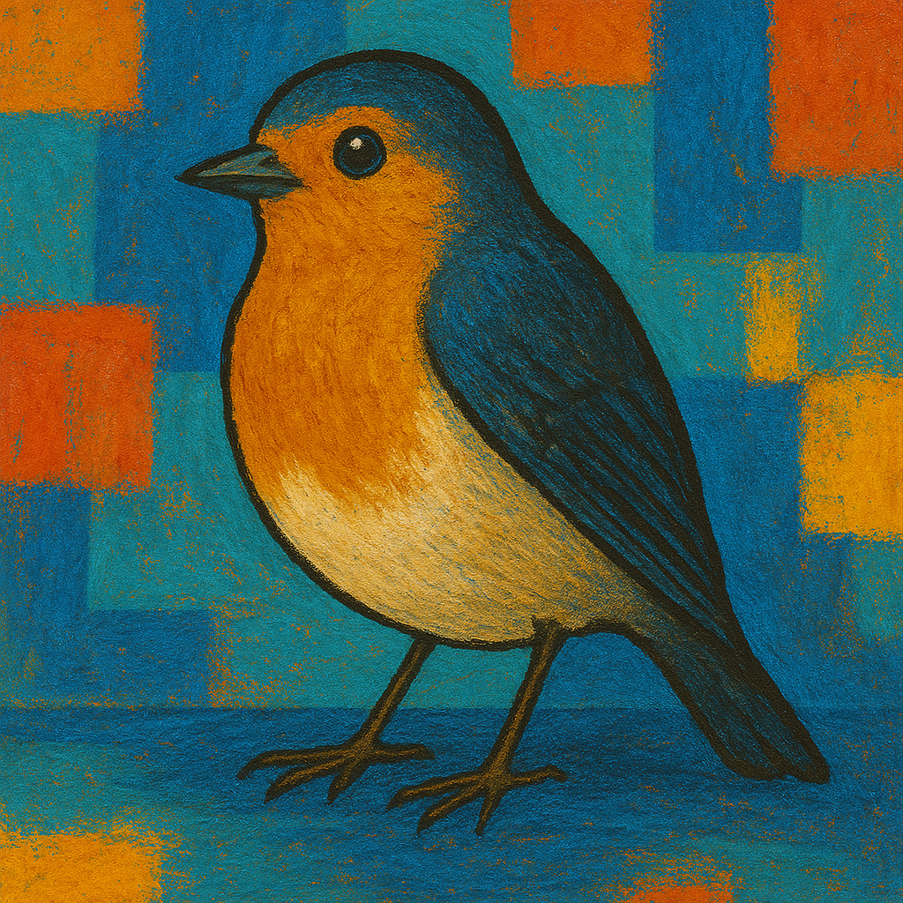

<!---
{
  "id": "00f91b51-4e5d-4e2f-9acd-be120706958e",
  "depends_on": ["3ee0acd9-0f99-4423-b4f3-a0ca84a16422"],
  "author": "Stephan Bökelmann",
  "first_used": "2025-04-13",
  "keywords": ["HTML", "vim", "images", "tables", "basic web design"]
}
--->

# Displaying Images in HTML

> In this exercise you will learn how to include images in an HTML document and organize them using tables. Furthermore we will explore how to reference local image files and format structured content clearly.

### Introduction

Building a website is a basic skill that every programmer should have. It's not just about creating flashy pages—it's about communicating ideas clearly and organizing documentation in a way that can be shared, reused, and understood by others.

HTML (HyperText Markup Language) has been a gamechanger ever since Tim Berners-Lee created the first HTTP server and browser in the early 1990s. It remains the backbone of the web today. With just a few lines of code, you can structure content that browsers interpret and display beautifully.

The best part? You don’t need a web server or internet connection to start learning. Everything begins locally—right on your own computer. All you need is a plain text editor and a browser. In this exercise, we’ll build on your previous work and add embedded images to your HTML page, displaying them inside a table layout.

### Further Readings and Other Sources

- [MDN Web Docs: HTML Images](https://developer.mozilla.org/en-US/docs/Web/HTML/Element/img)
- [HTML Tables Guide](https://developer.mozilla.org/en-US/docs/Web/HTML/Element/table)
- [W3C HTML Specification](https://html.spec.whatwg.org/)

---

## Tasks

### Task 1: Preparing Image Files

1. Make sure that three `.png` image files named `cat.png`, `dog.png`, and `bird.png` are available in your current working repository under the `./assets/` directory.

2. Confirm the directory structure and file names using:
   ```sh
   ls assets
   ```

### Task 2: Embedding a Single Image in HTML

1. Create a new HTML file:
   ```sh
   vim single_image.html
   ```
2. Insert the following content:
   ```html
   <!DOCTYPE html>
   <html>
   <head><title>One Image</title></head>
   <body>
       <h1>My Favorite Animal</h1>
       
   </body>
   </html>
   ```
3. Save and exit vim (`:wq`).
4. Open the file in your browser using your OS-specific command.

### Task 3: Organizing Multiple Images in a Table

1. Open or create another HTML file:
   ```sh
   vim gallery.html
   ```
2. Insert the following content:
   ```html
   <!DOCTYPE html>
   <html>
   <head><title>Image Gallery</title></head>
   <body>
       <h1>My Image Gallery</h1>
       <table border="1">
           <caption>Animal Gallery</caption>
           <tr>
               <th>Image</th>
               <th>Description</th>
           </tr>
           <tr>
               <td></td>
               <td>This is a cat.</td>
           </tr>
           <tr>
               <td></td>
               <td>This is a dog.</td>
           </tr>
           <tr>
               <td></td>
               <td>This is a bird.</td>
           </tr>
       </table>
   </body>
   </html>
   ```
3. Save and exit vim (`:wq`).
4. Open the file in your browser.

---

## Advice

This exercise is about visual representation. Images breathe life into a web page and are often more effective than words for communicating ideas. By learning to embed images and organize them in tables, you begin to understand how layout and content complement each other. Be consistent with your filenames, use meaningful `alt` attributes for accessibility, and keep exploring how HTML allows you to combine different types of content. 
